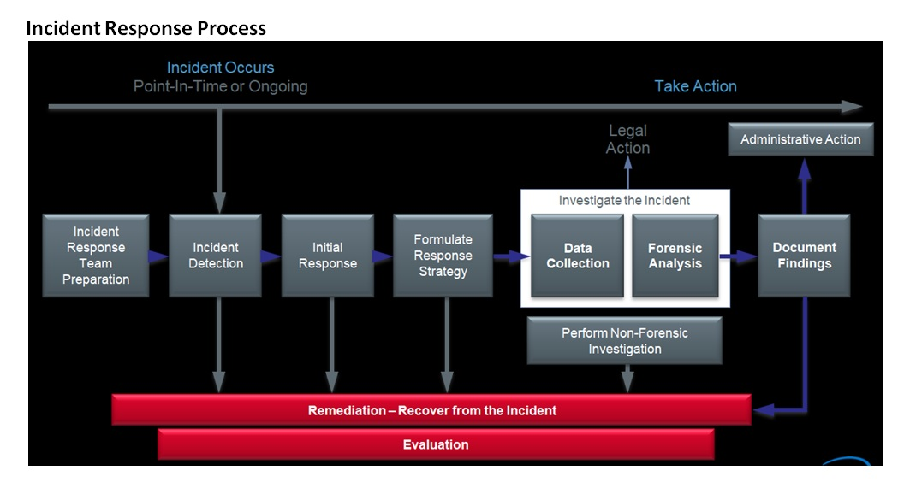
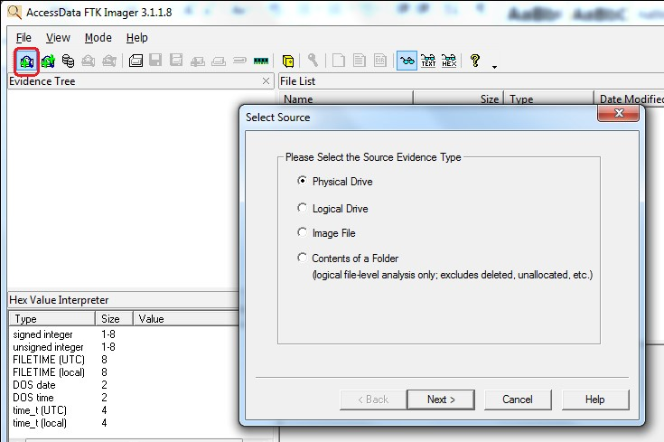
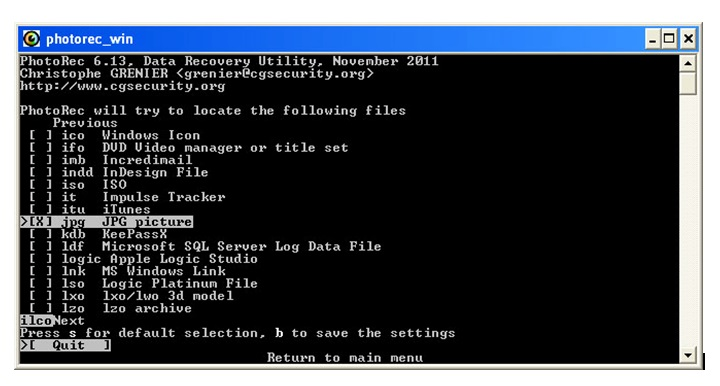

## Week 2 - Advanced Forensics              
### Introduction
After covering basics of malware, the next topic is Advanced Forensics. 
Forensics is a way to use scientific techniques (data analysis) to investigate and detect crimes.
 The crimes I'll focus on are malware-related.

A ***forensic investigator*** is trained to prove what happens on a system presented to him, 
***NOT*** to prove if the suspect is guilty or not. It's important to realize this so that 
all evidence can be preserved for later analysis. This data can then be used establish an
evidence-based history of events that occurred on a system under investigation. If the 
history proves the suspect is guilty is mostly irrelevant to the investigator, his job
is to establish what happened on the system. Incidentally, this may prove the suspect 
guilty as well.
### Major Forensic Case Types
* Fraud
* Intellectual Property Theft
* Hacker Intrusions / Data Breaches
* Inappropriate Use of Internet
* Child Exploitation
* eDiscovery supporting: Civil Litigation and  Litigation 

### Categories of Forensics
Besides case types, forensics cases can be classified into 3 categories depending on 
present state of system to be analyzed.
* ***Live forensics***: device is powered ON and has some data still stored in RAM. RAM contents
 are saved for later analysis before shutting device down. Footprint of backup program is kept low
 to not destroy memory contents.
* ***Post-mortem based forensics***: device is powered off. No available data is present in RAM,
only non-volatile storage media on device is used for further analysis.
* Network based forensics: Investigator doesn't have physical access to PC, only network access. 

### Basics of Forensics
To conduct an excellent forensic investigation, an investigator should follow 4 basic steps:
* Identify evidence
* Preserve evidence
* Analyze evidence
* Present results
For a more expanded view of this process, see flowchart below:

In order to complete these steps, there are also important guidelines a fellow investigator should follow:
* ***Minimize data loss.*** 
See ***Locard's Exchange Principle*** - You cannot interact with a live system without having some effect 
on it. If interaction is necessary, try to minimize it's effect and record your actions in that case.
* ***Record everything.***
Make note of start times at beginning of investigation/data backup.If PC is on, record its time. Record
 exactly what you did with the system. If there was contamination, record those details. Finally, be explicit, use screenshots. 

### Forensic Evidence
What is evidence? It's anything you can use to disprove/prove a fact. In context of computer forensics,
 evidence can be found at many different layers: network(firewalls), OS, databases and applications, peripherals, etc. 
#### Handling Evidence
To minimize data loss, you must preserve integrity of the evidence at all times:
* Create a cryptographic hash of the entire disk and each partition (MD5 or SHA1)
* Create bit-images copies and analyze them
* Create a cryptographic hash of the copy and compare with the results obtained from the original. They MUST match!

### Forensic Software Tools (free)
Evidence analysis is rarely done without using software tools. This is especially true today with today's technology. 
Hard drives now have terabytes of storage, impossible to analyze thoroughly and quickly without software tools. 
Some common tools used for forensic investigation are listed below

* ***FTK Imager***: allows user to backup PC memory(RAM), storage, master boot record, and page file data for forensic analysis.
This program is used to record all of the forensic data for analysis later. Since it has a GUI interface, it's not the best one 
to use to minimize RAM footprint impact.

* ***Volatility***: an advanced memory forensics framework written in Python, command-line
•	Write & create your own plugins
•	Lot of useful plugins for malware detection
•	Usage:
o   volatility.exe  –h: lists all of the plugin options
o	volatility.exe –f <name_of_memdump> plugin
o	-imageinfo: reports the OS type based on memory dump structure
o	-psscan: lists processes running in memory at time of dump
o	-pstree: draws all running processes in parent/child tree

* ***PhotoRec***: restores and carves out files in a referenced disk image based on header data. 
After running program, the output directory will contain all files recovered.

[Go Home](../index.md) 
