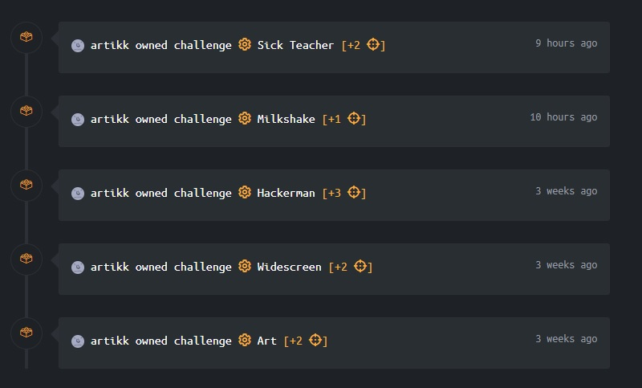
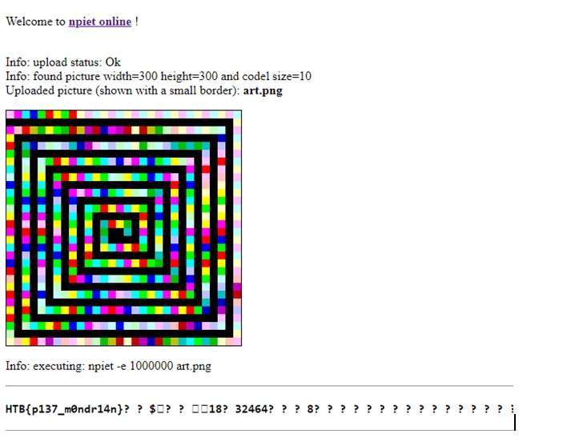
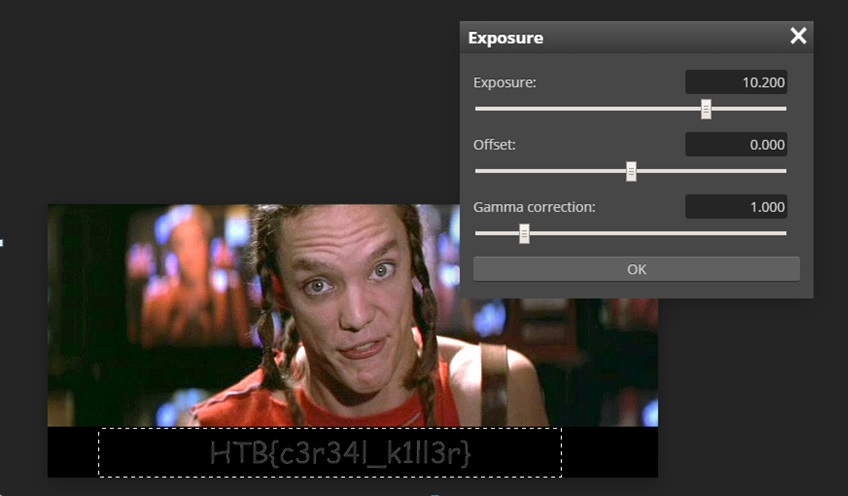
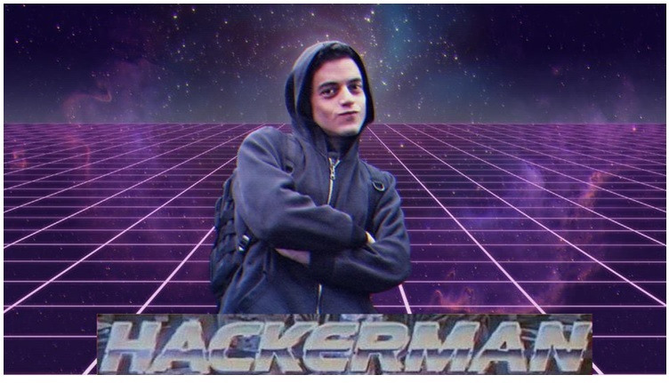
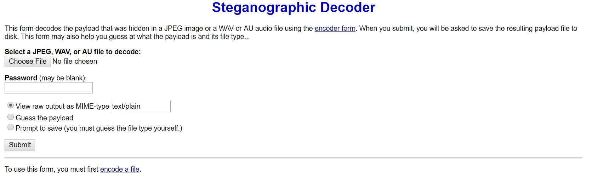
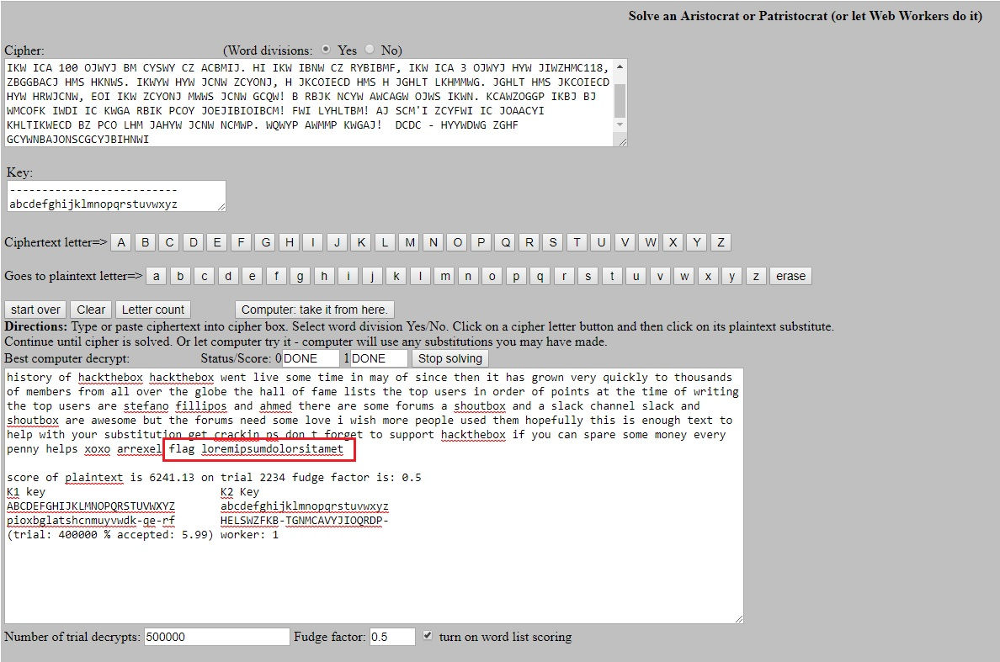

## Week 10 - HackTheBox Final Report           
### Introduction
This post focuses on the Final assignment in the class. It discusses the various
HackTheBox site challenges I did to meet the requirements.

### Getting Invite
Signing up for a HackTheBox invite was an interesting challenge. 
1.  On the invite page, I found an obfuscated javascript code snippet, seen below:
```javascript
eval(function(p,a,c,k,e,d){e=function(c){return c.toString(36)};if(!''.replace(/^/,String)){while(c--){d[c.toString(a)]=k[c]||c.toString(a)}k=[function(e){return d[e]}];e=function(){return'\\w+'};c=1};while(c--){if(k[c]){p=p.replace(new RegExp('\\b'+e(c)+'\\b','g'),k[c])}}return p}('1 i(4){h 8={"4":4};$.9({a:"7",5:"6",g:8,b:\'/d/e/n\',c:1(0){3.2(0)},f:1(0){3.2(0)}})}1 j(){$.9({a:"7",5:"6",b:\'/d/e/k/l/m\',c:1(0){3.2(0)},f:1(0){3.2(0)}})}',24,24,'response|function|log|console|code|dataType|json|POST|formData|ajax|type|url|success|api|invite|error|data|var|verifyInviteCode|makeInviteCode|how|to|generate|verify'.split('|'),0,{}))
```

2. Using this code as reference, I called function ***makeInviteCode()*** in browser console. 
 This gave me a HTTP response with data:
``` javascript
0: 200
data: "SW4gb3JkZXIgdG8gZ2VuZXJhdGUgdGhlIGludml0ZSBjb2RlLCBtYWtlIGEgUE9TVCByZXF1ZXN0IHRvIC9hcGkvaW52aXRlL2dlbmVyYXRl"
enctype: "BASE64"
```

3. I then decoded the data property using https://www.base64decode.org/ and got the following message:

```In order to generate the invite code, make a POST request to /api/invite/generate```

4. Finally, I made the POST request to suggested link and received another encoded string:

```SFZFUkYtVlJIRVAtWExWUVktSVlSUEYtR0lSRUg= ```

I decoded it using BASE64 and got the invite KEY: 

```HVERF-VRHEP-XLVQY-IYRPF-GIREH```


### Challenge Summary
I completed 5 challenges:
*   Misc - Art  (20 pts)
*   Stego - Widescreen (20 pts)
*   Stego - Hackerman (30 pts)
*   Stego - Milkshake (10 pts)
*   Crypto - Sick Teacher (20 pts)

***Total = 100 pts***

 


### Challenge 1: Art [ 20 pts ]

***Category:*** Misc

***Prompt:*** Can you find the flag?

For this challenge, I received a colorful image and had to find the required HTB{flag} from it.
Since this challenge wasn't classified in Steganography category, the flag information wasn't 
directly embedded in a secret way  in the provided image. In other words, the flag string wasn't
hidden using image manipulation techniques like contrast, hue, brightness adjustments. 
Therefore, I had to look for another way to extract this info. After some research and hint from 
HackTheBox forums, I found an obscure computer language, Piet, that interpets image colors as 
specific computer instructions. With certain color combinations, it can easily print "Hello World". 

[Piet Wiki Link](https://en.wikipedia.org/wiki/Esoteric_programming_language#Piet)

Finally, I found a Piet interpreter/compiler online and uploaded the challenge image to it. 
After, I found the HTB flag by looking at Piet program's output. See screenshot below for details. 



***Flag = HTB{p137_m0ndr14n}***


### Challenge 2: Widescreen [ 20 pts ]

***Category:*** Steganography

***Prompt:*** Someone has leaked pictures of our unreleased movie. Can you help identify him? 

For this challenge, I received a movie screenshot image and had to find the required HTB{flag} inside of it.
This challenge was classified under steganography, so the flag information was embedded inside the image file
somehow. There are multiple way of hiding information inside an image file. One common way is to 
encode information within the lowest bits of image information. The lowest bits (as their name implies) 
have the lowest impact on image appearance and therefore a very popular target of manipulation.

In this case, the information was hidden using a much simpler method. First, I used an online image 
viewer, [photopea.com](http://www.photopea.com) to open the image for further adjustments. 
After multiple tweak attempts, I changed the exposure level for bottom black section of image and found the flag.
See image below for uncovered flag.



***Flag = HTB{c3r34l_k1ll3r}***


### Challenge 3: Hackerman [ 30 pts ]

***Category:*** Steganography

***Prompt:*** There should be something hidden inside this photo... Can you find out?
See photo in question below:



For this challenge, I received an image and had to find the required HTB{flag} inside of it.
This challenge was classified under steganography, so the flag information was embedded inside the image file
somehow.

By using just simple image manipulation techniques, I wasn't able to extract any useful info about the flag.
In frustration, I visited the HackTheBox forums and looked for help on this challenge. The only clue I received 
for it was the keyword ***almost***. Since the flag text wasn't directly drawn using pixels in the image,
my guess it was encoded using another method inside the image data. To decode this encoded message, usually a
key or password is required to start the process. Using the forum clue, I guessed the key was ***almost***.

After that, I visited one of the sites that does image decoding/encoding conveniently for the user:
. See screenshot of page that decodes the image:



I uploaded the provided image to be decoded on this page and entered the password ***almost*** into the field 
as well. The site spit out the following encoded string: 

```SFRCezN2MWxfYzBycH0=```

This looked like an encoded string, so I went to base64decode.org site and decoded it. It read: HTB{3v1l_c0rp}, 
therefore flag found!

***Flag = HTB{3v1l_c0rp}***


### Challenge 4: Milkshake [ 10 pts ]

***Category:*** Steganography

***Prompt:*** Can you bring all the boys to the yard? 

For this challenge, I was given an mp3 song, ***Milkshake***, from 2003 album ***The Neptunes Present-Clones-AD***
by artist ***Kelis***. Looking at the file metadata for flag clues didn't help too much. After some google research, I
found a helpful tutorial on sound file stego analysis using SoundVisualizer program.
See [tutorial link](https://solusipse.net/blog/post/basic-methods-of-audio-steganography-spectrograms/)  provided for more details.

After loading the Milkshake MP3 file into SoundVisualizer, I easily found the flag by just looking
at the spectrogram of the sound data. It was literally a one-click operation.
A lot of challenges become easy once you have the right tool. 
See screenshot below:


***Flag = HTB{str4wberry_milkshak3}***


### Challenge 5: Sick Teacher [ 20 pts ]

***Category:*** Cryptography

***Prompt:*** Can you break the cipher? 

For this challenge, I was given an ecrypted text file with the following text:


```KBJICYP CZ KHLTIKWECD

KHLTIKWECD RWMI GBQW JCNW IBNW BM NHP CZ 2017. JBMLW IKWM, BI KHJ FYCRM QWYP VOBLTGP IC IKCOJHMSJ CZ NWNEWYJ ZYCN HGG CQWY IKW FGCEW.
IKW KHGG CZ ZHNW GBJIJ IKW ICA 100 OJWYJ BM CYSWY CZ ACBMIJ. HI IKW IBNW CZ RYBIBMF, IKW ICA 3 OJWYJ HYW JIWZHMC118, ZBGGBACJ HMS HKNWS.
IKWYW HYW JCNW ZCYONJ, H JKCOIECD HMS H JGHLT LKHMMWG. JGHLT HMS JKCOIECD HYW HRWJCNW, EOI IKW ZCYONJ MWWS JCNW GCQW! B RBJK NCYW AWCAGW OJWS IKWN.
KCAWZOGGP IKBJ BJ WMCOFK IWDI IC KWGA RBIK PCOY JOEJIBIOIBCM! FWI LYHLTBM! AJ SCM'I ZCYFWI IC JOAACYI KHLTIKWECD BZ PCO LHM JAHYW JCNW NCMWP. WQWYP AWMMP KWGAJ!

DCDC - HYYWDWG
ZGHF GCYWNBAJONSCGCYJBIHNWI```


After trying a bunch of cryptography tools online, I couldn't decipher the text for a while. There are simply too many
encryption algorithms to try though challenges that are worth this few points don't have fancy encryption.
After more searching, I found the following online decoder that helped me decipher the encoded text. Apparently the cipher used is 
Aristocrat or Patristocrat.

[https://bionsgadgets.appspot.com/ww_forms/aristo_pat_web_worker3.html](https://bionsgadgets.appspot.com/ww_forms/aristo_pat_web_worker3.html/)  

After pasting the encrypted text, the plain text was easily deciphered. See screenshot below, with flag text circled in red color.



***Flag = HTB{loremipsumdolorsitamet}***


[Go Home](../index.md) 
