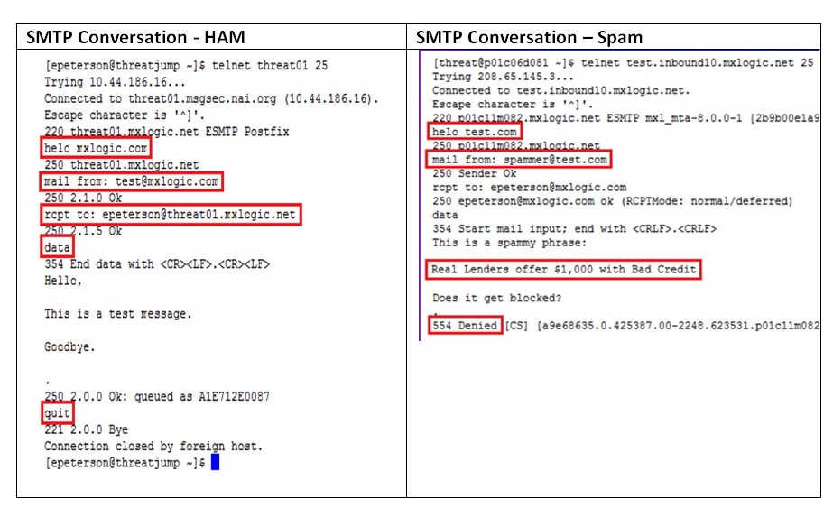

## Week 8 - Message Security           
### Introduction
This week's material focuses on topic of Message Security. Spam or malware is commonly
delivered through email message using phishing techniques. Users think an incoming
email is from a legitimate company like their bank. After navigating to a web page, 
they then submit their account info and that's how their identity is compromised. 

This post discusses common terminology in message security, common spam techniques, 
and ways to classify incoming message as spam/not spam. Although this week discussed
a lab classifying spam messages using SQL server, I didn't work on it because I didn't 
see the point. The classification for this lab would be similar to last week's URL
classification, just with tokens/attributes changed.

### Common Terminology
*	***Spam*** – bad or illegitimate messages
*	***Ham*** – good or legitimate messages
*	***Spamtrap or Honeypot***
    *	domain or IP address that receives only spam messages. It’s setup in such a way
     no legitimate email goes there.
    *	How to setup: create new domain, then release info about spamtrap PC in a public 
    area so that bot spiders can see it and send spam to it

*	***Botnet*** 
    *	group of computers that have been taken over and are usually used for malicious 
    purposes. End user for any botnet computer is usually not aware that his PC is part of botnet. 
    *	Common botnet: Zeus
*	***Snowshoe spam*** 
    *	sends spam from multiple, usually unrelated ip addresses
    *	it's an attempt to get around IP reputation filters
*	***Phishing*** vs ***Spear Phishing***
*	***RBL (Realtime Blackhole List)***
    *	a dynamic list of IP address owners that are active spammers or spam sources. 
    *   most important sources of information regarding spammers
    *	is an effort to stop email spamming
    *	The RBL may include Internet service providers (ISP) with customers that are known
     spammers or ISP servers that are hijacked for spamming purposes. 
    *	many companies own RBLs. How can one trust a company with an RBL? 
*	***Heuristic filters***  - popular technique of email-filtering. It uses general spam
 rules to classify incoming email based on message data characteristics as spam/not spam. 
Ex: if email contains Viagra or Ophrah string and some other tokens, it’s spam.
*	***Bayesian (Statistical) filters *** – popular technique of email-filtering. 
It correlates the use of tokens (typically words, or sometimes other things), 
with spam and non-spam e-mails and then using Bayes' theorem to calculate a
 probability that an email is or is not spam.

### Classic Spam Messages
*	***advance-fee scam*** – promising victim a large sum in return for small up-front payment
    *	Other names: 419 phishing or Nigerian Prince scam
*	***Canadian pharmacy*** – spam message advertises cheap pharmaceuticals without prescription. 
Takes client’s order, then never sends anything.
*	***pump-and-dump*** – sends messages with misleading rumors/news to influence stock prices,
 and then quickly sells stock to profit from news.

### Fighting Against Spam
There are primarily two ways to fight against spam (not including educating user). They are filtering
messages by reputation or content. 
*	***Reputation-driven***
    *	IP
    *	Message
    *	URL
*	***Content-driven***
    *	Common strings
    *	Fixed strings vs variable strings (Regular Expressions)
    *	Message attributes
    *	Combinations of strings and attributes (Meta Rules)

### Email examples (as received by SMTP)
See image below for examples of good and bad email messages as received
by SMTP server. As soon as the server receives a matching string according to
set spam rules, the email reception is terminated.

 

### Tools (for Research Purposes)
*	Linux Tools
    *	DIG - Domain information groper – investigation of DNS records
    *	WHOIS – Searching for IP/Domain registration information
    *	Grep, SED, AWK – data parsing and manipulation 
*	Open-source databases
    *	PostgreSQL – “The world's most advanced open source database”
    *	MySQL – “The world's most popular open source database”
*	The Regex Coach - Regular Expression syntax/functionality learning aid
*	Trustedsource.org - Historical & current reputations based on McAfee data
*	Spamhaus.org - Widely accepted as an authoritative source of reputation data (Especially in NA)

### Data Scientific Method
1. Start with data.
2. Develop intuitions about the data and the questions it can answer.
3. Formulate your question.
4. Leverage your current data to better understand if it is the right
question to ask. If not, iterate until you have a testable hypothesis.
5. Create a framework where you can run tests/experiments.
6. Analyze the results to draw insights about the question.

[Go Home](../index.md) 
