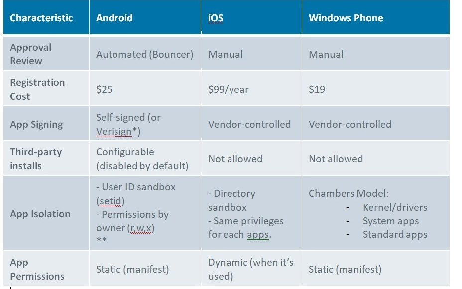

## Week 9-10 - Mobile Security           
### Introduction
This week's material focuses on topic of Mobile Security. Some security and architecture
info is provided on popular mobile OSes: Android and IOS. After that, mobile malware and botnets
are discussed in a short overview.  

### Mobile OS Timeline After Android
1.	Late 2009: Android-powered devices launched.
2.	Jan 2010: Nexus One
3.	May 2010:  Android 2.2 (Froyo) with multi-tasking.
4.	May 2012:  Android surpasses Apple iOS
5.	Nov  2013:  Android doubles Apple iOS market share 

### Apple – IOS
*	Started the smartphone revolution in 2007 with the iPhone.
*	Closed source and proprietary and present only in Apple devices 
*	Fully integration with Apple services and software: iCloud, Safari, App Store, Siri, iTunes, FaceTime, iMessage, Game Center etc..
*	Derived from Mac OS X:	XNU Kernel, Mach-O file format.
*	iTunes for Sync, backup, updates.
    *	Over-the-air updates (since iOS 5).
*	Multi-tasking (since iOS 4).

### Google – Android
*	Developed by Android Inc in 2005. Acquired by Google in 2007.
*	Supported by the Open Handset Alliance 
*	Free and open source (ok, not all).
*	Besides ARM, x86 and MIPS CPUs supported.
*	Over-the-air updates

### Mobile OS Security Features

### Mobile Malware History
#### IKEE – First IOS Malware
*	Discovered in November 2009 in Netherlands
*	Jailbroken iPhones - $5 ransom to remove the malware
*	Used default SSH password “alpine” to remotely infect users.
*	2 days later, another variant appeared in Australia

#### First Android Malware
*	FakePlayer:
    *	Found in the wild in August 2010.
    *	Very simple and limited functionality.
    *	Pretends to be a media player application.
    *	SMS Trojan: 
        *	Sends SMS messages to premium-rate numbers.
        *	Payload executed in the background without user’s consent.
*	Tapsnake:
    *	Found at almost same time as FakePlayer (August 16).
    *	First Android malware found in Android Market (now Google Play).
    *	Tracks GPS coordinates and sends to a remote server.
    *	Service running in the background started after boot (novel feature)

#### Genimi – First Android Botnet
*	Found December 2010 (after Christmas) 
*	Distributed in third-party markets in China.
*	First “repackaged” Android malware.
*	Leaks sensitive information to a remote server:
    *	Location coordinates (GPS), Device identifiers (IMEI and IMSI), list of installed applications.
*	Download additional APKs
*	Prompt the user to uninstall an application.
*	Executes commands sent by a remote C&C server.

*** Malware Trend ***
There is an increasing trend in new malware created for mobile OSes. See graph below for details

[Go Home](../index.md) 
