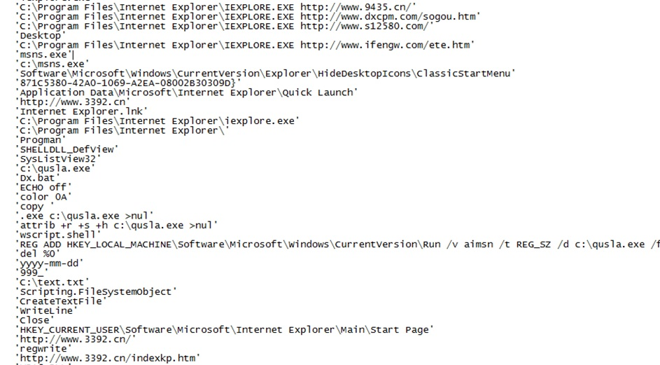
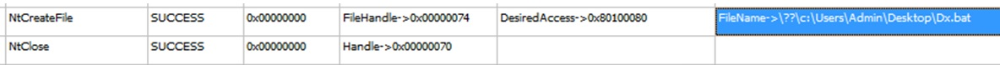

## Week 4 - Software Vulnerabilities and Exploits              
### Introduction
This week I'll cover some major types of software expoits used for gaining access to computer systems.

### Attack Graph
An attack graph describes how malware operates. The real graph is fairly big and hard to follow. I'll just summarize the 4 steps of attack:
* First Contact
* Local Execution
* Establish Presence
* Malicious Activity


```
attrib +r +s +h c:\qusla.exe
```
Then, it adds qusla.exe to Windows startup by creating the appropriate registry key at HKLM\Software\Microsoft\Windows\CurrentVersion\Run
*	Finally, it changes start page for Internet explorer to ***http://www.3392.cn***.
See FileInsight screenshot for condensed string dump of program’s contents



* It created ***Dx.bat*** file, a batch file that runs commands

 


[Go Home](../index.md) 
