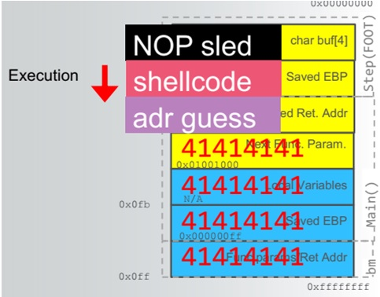

## Week 4 - Software Vulnerabilities and Exploits              
### Introduction
We will cover some major types of software exploits used for gaining unathorized access to computer systems. 
After that, I included a summary of a Stack overflow exploit Lab, with screenshots and commands.

### Manipulating Software 
*	Finding “bugs” which alter behavior of the program. They are commonly referred to as ***exploits***.
*	Taking advantage of a misconfiguration or poor programming practice

### Flaw Classes and Vulnerabilities
*	***Configuration*** – weak password
*	***Logic*** – authorization issues
*	***Storage*** – inadequate encryption
*	***Input validation*** - memory corruption and injection

### Memory corruption 
This is accessing memory in an invalid way which results in an undefined behavior (which we’re looking to control). 
The labs for this week focused on this type of exploitation, with memory located in stack or heap.
Types: 
*	Lifetime control 
*	Uninitialized memory
*	Array index calculations
*	buffer length calculations 

### Exploitation
The general structure of an ***exploit*** consists of 2 things:
* Vulnerability trigger - invokes the software bug to obtain control of the program
* Payload - action to be performed when control is obtained. Also referred to as ***shellcode***, usually assembly code to execute a shell.

### Code Execution
1.	Crash Triage

    a.	What do we control? 

        i.	registers that contain and point to attacker-controlled data
        ii.	is controlled data on Stack or Heap

    b.	Where are we in the execution of the program?

        i.	Where is the vulnerability? 
        ii.	Was the crash caused by an exploit mitigation?

2.	Determine the return address offset - Figure out the offset to EIP overwrite
3.	Position our shellcode
4.	Find the address of our shellcode
See example of exploit embedded as part of stack.


### Labs
#### WinDbg program
For all labs this week, one program was used to debug and control execution of program precisely.
This  ***WinDbg***, a freeware program that can be attached to running process to view
its operations. Some useful commands are below:
*	g - start running the program
*	lm – list modules
*	lmf m <string>: list all modules matching specific string
*	bp <address> - add breakpoint at address
*	bl – breakpoint list, bc – clear breakpoints
*	t <number>  - step into/move <number> steps
*	d*  –display values in memory (dd – dword, da – ASCI value, du  - Unicode value, db – byte)
*	poi<address> – Follow reference for the given pointer (handle) address
*	u <address> - show dissasembly 
*	!teb - display formatted view of the thread's environment block (TEB or STACK)
*	!peb - display formatted view of the process's environment block (PEB or HEAP)
*	!heap – displays all heap contents
*	!address <addr>: shows info for region with addr
*	k – shows call stack with child EBP addresse

#### Lab 2 - Lesson 2 (Stack Overflow Exploit)
This exploit used a vulnerability in a purposefully created ActiveX script loaded in HTML page in Internet Explorer.
***1-2. Determine return address offset***
To accomplish this, we first added a string with metaexploit pattern inside L2Exercise1() function and triggered the exploit in Lesson 2 page. 
```
function L2Exercise1(){
    var s = msfPatternString;
    FSEExploitMe.StackBuffer(s);
}
```
Then, in WinDbg, module byakugan was run to find the offset from patterned string.
WinDbg commands:
```
!load byakugan
!pattern_offset 2000
control of eip at offset 1028
```
Having the offset 1028 now allows us to use a general string of size 1028 
(using MakeString(1028/2)) to point correctly to EIP register address offset.

***3. Position our shellcode***
After finding EIP address location on stack, we need to position our shellcode to execute 
from that address. To do that, we will search for a ***jmp esp (hex=ff e4)*** instruction in exploit
dissassembly contents. This will the stack to jump to this instruction right after returning 
rom initial function call. One of the memory locations that have this instructions is: 54432159
WinDbg commands to find instruction
```
lmf m FSExploitME
s 54430000 5443b00 ff e4 
```

***4. Find the position of our shellcode***
After finding the jmp instruction, an extra instruction "\u4141\u4141" was added to account
for ret 4 call subtracting 4 bytes from stack. 
After that instruction, the shellcode was position and Calculator was executed.
Final version of Lab 2 javascript code:


#### Lab 3 - Heap Exploit
I started doing this lab but never got to the point of running Calculator.

[Go Home](../index.md) 
