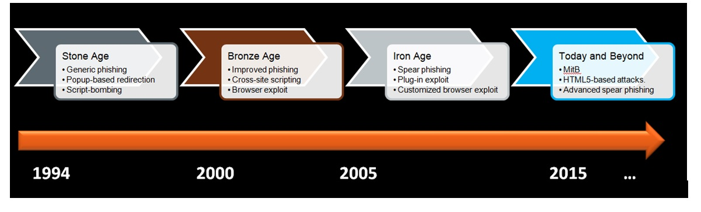

## Week 7 - wEB Security           
### Introduction
This week's material focuses on topic of Web Security. It's a very important topic
because 95% of malware is delivered via the web. This page will focus on some examples
of web attacks: user or browser-focused. It will also mention some software tools 
useful for analyzing visited domains and malware encountered by user.

### Evolution of Web-based Malware Attacks
Over time, the sophistication of web-based malware attacks has increased. See 
flowchart below for more details.

 

### User-level Attacks
*	Users can be ARE the weak link.
    *	Hardened/current browser/OS will not help.
    *	Exploit common user traits: Impatient, lazy, self-proclaimed omniscience, clickaholic 
*	Direct the user to malicious content through their own actions.
    *	Attack types: Phishing, SEO Poisoning, Fake AV, Social Media Link Insertion, 
    Forum Link Insertion, Malvertising

Some of the attack types are described in more detail below.

#### Phishing
*	Not just restricted to banking/financial anymore
*	URLs not always delivered via email.
*	Spear phishing, social media, and snowshoe spam continues to keep it alive.

#### SEO Poisoning
*	Identify trends using available tools such as Google Trends
*	Use search results to lure the web-searching victim.
*	Game the search engine’s relevance rules
*	Site redirects to malicious content

#### Fake Updates & Fake AV
*	Preys on user’s good intentions. 
*	Often mimics OS-level UI components or well-known security brands.
*	May deliver malware

#### Social Media Attacks
*	Social media: A gift to malware authors
    *	Anti-spam systems have become very effective.Social media opens a new world for malicious URL delivery and information gathering
*	I saw the link on the Facebook and Twitter, so it must be OK, right?

***Malvertising*** - Malicious actor uses advertising networks as delivery mechanism for malware

### Common Defenses against User Attacks
*	URL/Domain Reputation Systems
    *	Real-time protection in browser or network device.
    *	Search result link annotation
*	Site Certification Services
*	Client and Gateway AV/AM
*	Safe URL Shorteners
*	Content provider education
    *	Banks love to train their customers to be phishing victims.
    *	Brand monitoring services
*	End user education
    *	The Human Firewall. Good luck with that.
    *	In reality, some progress has been made, although we are always a step behind. 

### Browser Attacks
*	Browser Exploits - browser downloads, renders and executes maliciously crafted web content.
*	MITM(man in the middle) and MITB(man in the browser) attacks
*	SQL Injection - circumvent authentication/authorization in SQL database, then reveal private data
*	Cross-site scripting (XSS) – injects client-sidescript into other user’s browsers (bypassing SOP)
*	Cross-site Request forgery (XSRF):
    *	 exploit the server’s trust in the browser
    *	execute malicious actions against user (as that user) on their trusted server
*	Using vulnerabilities in new features of HTML5

### Web Malware Tools
*	***Alexa*** – useful for determining site popularity and prevalence
*	***IPVoid*** – check an IP against a large list of IP blacklists
*	***ChecksShortURL***  - URL explander service for most short URL services
*	***Webutation***  - URL reputation clearinghouse
*	***Web Inspector*** – online web scanning tool. Provides list of recently detected bad sites
*	***Virus Total***  - web scanning tool, provides malware and URL search
*	***Linux whois and DIG***  - provides DNS resolver info

[Go Home](../index.md) 
