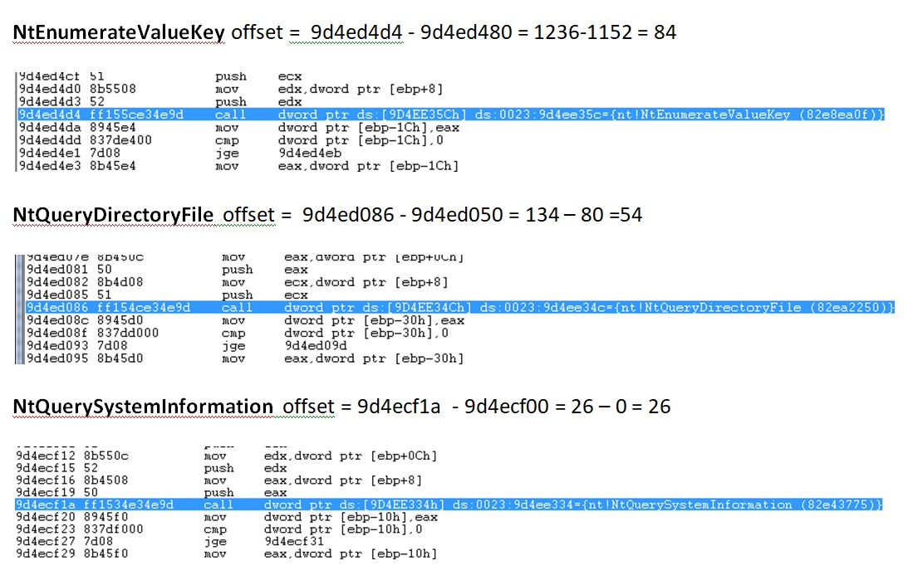

## Week 5 - Windows Internals              
### Introduction
This week's material focuses on learning about Windows kernel and other parts of Windows internals. 
Rootkits are programs usually infiltrate the kernel modules or various important storage sectors
to gain unathorized access. Learning about how they gain access, let me understand internals of Windows OS
better. 

Besides summarizing lecture content for this week, I also included details on Agony rootkit Lab, with screenshots.
All Labs were performed with Tuluka and Cuckoo to run the malware and Windbg to trace the rootkit's instructions
through the kernel.

### Rootkits
*	***rootkit***  -  malware that actively conceals its existence and actions from users and system processes.
*	Approximately 10% of current malware use rootkit
*	Rootkits are most prevalent in 32 bit Windows. Handful of families so far for 64 bit
*	***Rootkits are one of the best ways to learn about kernel security challenges***
*	Challenges once malicious code enters kernel:
*	Harder for rootkits to enter 64 bit kernel
*	Rootkits can infiltrate 64 bit OS Kernel by

### Kernel memory
In this section, we'll focus on Kernel. See below for a pic of generalized OS architecture model.

*	Is a flat memory model with no security separation. 
*	Any kernel driver can access any part of memory. 
*	Composed of windows kernel (ntoskrnl.exe) as well as driver code. 
*	Many important structures that are prime targets for stealth: SSDT, IRP, IDT etc. 
*	Windbg commands:  .process command, lm, !devobj, !drvobj, !devstack, !irp etc. 

### Process Memory
*	processes are implemented as objects
*	an executable process may contain one or more threads
*	process includes an object table that has handles to other objects known to this process
*	Contents: 
*	image – holds binary image of program
*	allocated memory by program
*	loaded modules or DLLs
*	page –fixed-length block of memory, smallest unit of data for memory management in a virtual memory OS.

### Hooking System APIs
*	***hook*** – code that handles intercepted function calls between software components
*	used to alter or augment the behavior of an operating system or application components 
by intercepting function calls or messages or events passed between software components. 

### Trends in Stealth Malware 
*	file forging – overwrite existing files and forge the ‘view’ such that AV gets the clean view instead of malicious
    *  Better than hiding files
        *	Hidden files can be located using file-system parsers etc
        *	Comparing file contents is time consuming
        *	Forging can work well from layers below file-system (NTFS )
*	memory forging
*	self protection, attack AV, 
*	disassociating memory from file-on-disk
    *	Rootkit’s memory can give away its associated file on disk. The problem is it can be difficult to track kernel memory
*	 removing dependency on files
    *	Scanners based on direct file-system (FS) parsers worked well
    *	Therefore having no file in the filesystem helps rootkits
*	 untrusting the trusted

### Limited Self Preservation 
*	Defend components and/or attack security components
*	Watcher threads
    *	To monitor and protect memory hooks and disk changes
    *	To rewrite registry, files, gain exclusive locks from SYSTEM etc
*	Attack from kernel (mostly name based)
    *	Callback registration to attack during process, module load etc

### Holistic Self Defenses
*	Behavioral identification of AV
    *	Identify the AV activity by monitoring the behavior of the process or thread, if it triggers their behavioral detection logic, the AV is terminated.
*	Untrusting the AV and whitelisting of legitimate applications

### Agony Lab
This lab focuses on analyzing rootkit Agony. Focus was on mostly
tracking exit points from malware code back to the kernel APIs hooked by malware.
#### Software Tools
Software programs used for Lab: Tuluka, Cuckoo, and WinDbg. Cuckoo was used to run the malware
and record its actions into a log file. Tuluka was used to identify changes in SSDT table done by
rootkit to allow hooks into system-level modules. Finally, WinDbg was used in remote mode to debug
and step through to find hook memory locations in rootkit memory space.

#### Results
The rootkit hooked the following 3 system APIs:
* ***NtEnumerateValueKey***
* ***NtQueryDirectoryFile***
* ***NtQuerySystemInformation***

Using Tuluka, SST table changes were clearly detected:

To track down where rootkit returned control back to system API,
a breakpoint was placed at memory address in Current column. Then,
using system disassemly, I stepped through the instructions until
the original API was called back by rootkit. 

See screenshot below for offset calculations

[Go Home](../index.md) 
